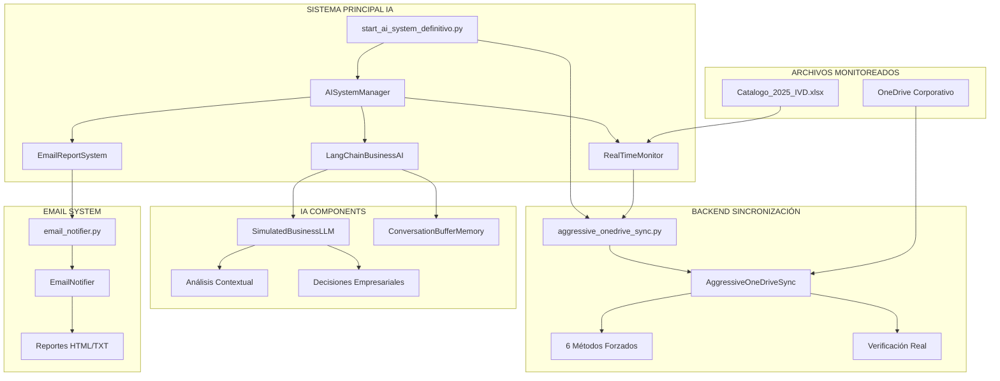
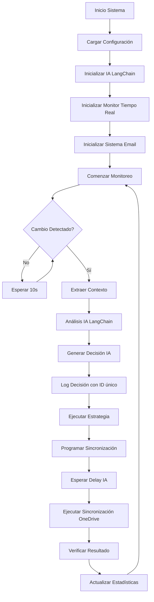

# README_Arquitectura.md
# Análisis Técnico Completo del Sistema OneDrive IA

## Tabla de Contenidos
1. [Arquitectura General](#arquitectura-general)
2. [Análisis Línea por Línea](#análisis-línea-por-línea)
3. [Librerías y Dependencias](#librerías-y-dependencias)
4. [Clases y Funciones Detalladas](#clases-y-funciones-detalladas)
5. [Componentes IA vs Tradicional](#componentes-ia-vs-tradicional)
6. [Diagramas de Flujo](#diagramas-de-flujo)

---

## Arquitectura General



---

## Análisis Línea por Línea

### start_ai_system_definitivo.py - Script Principal

#### Importaciones y Configuración (Líneas 1-50)

```python
# Líneas 1-10: Importaciones básicas del sistema
import os, sys, time, importlib, signal, threading
from datetime import datetime
from pathlib import Path
```

**Análisis:**
- `importlib`: Permite recargar módulos dinámicamente
- `signal`: Manejo de señales del sistema (Ctrl+C)
- `threading`: Concurrencia para monitoreo en tiempo real
- `pathlib`: Manipulación moderna de rutas de archivos

```python
# Líneas 11-16: Recarga dinámica de módulos
if 'backend.aggressive_onedrive_sync' in sys.modules:
    importlib.reload(sys.modules['backend.aggressive_onedrive_sync'])
    print("Módulo OneDrive recargado")
```

**Análisis:**
- Soluciona problema de cache de Python en desarrollo
- Asegura usar código más reciente sin reiniciar Python
- Crítico para testing y debugging

```python
# Líneas 20-40: Importaciones LangChain
from langchain.memory import ConversationBufferMemory
from langchain.schema import HumanMessage, SystemMessage
from langchain.prompts import PromptTemplate
from langchain.llms.base import LLM
```

**Análisis de Librerías LangChain:**
- `ConversationBufferMemory`: Almacena historial de conversación IA
- `HumanMessage/SystemMessage`: Formato de mensajes para IA
- `PromptTemplate`: Plantillas para generar prompts dinámicos
- `LLM`: Clase base para modelos de lenguaje

```python
# Líneas 24-35: Configuración de Email
EMAIL_CONFIG = {
    'enabled': True,
    'provider': 'gmail',
    'smtp_server': 'smtp.gmail.com',
    'smtp_port': 587,
    'username': 'tu_email@gmail.com',     # PROBLEMA: Hardcodeado
    'password': 'tu_app_password',        # PROBLEMA: Hardcodeado
    'from_email': 'tu_email@gmail.com',   # PROBLEMA: Hardcodeado  
    'to_email': 'destinatario@empresa.com', # PROBLEMA: Hardcodeado
    'report_interval_minutes': 30
}
```

**Análisis Crítico:**
- ❌ **PROBLEMA PRODUCCIÓN**: Credenciales hardcodeadas
- ❌ **PROBLEMA SEGURIDAD**: Contraseñas en código fuente
- ❌ **PROBLEMA PORTABILIDAD**: No funciona en otros sistemas

#### Clase SimulatedBusinessLLM (Líneas 51-120)

```python
class SimulatedBusinessLLM(LLM, BaseModel):
    """LLM empresarial simulado optimizado para análisis de catálogos"""
    
    def _call(self, prompt: str, stop: Optional[List[str]] = None) -> str:
        # Análisis contextual del prompt
        prompt_lower = prompt.lower()
```

**Análisis Arquitectural:**
- **Hereda de `LLM`**: Cumple interfaz LangChain estándar
- **Hereda de `BaseModel`**: Validación de datos con Pydantic
- **Método `_call()`**: Núcleo del procesamiento IA

**Lógica de Decisión IA:**
```python
if "cambio detectado" in prompt_lower or "archivo modificado" in prompt_lower:
    if "catalogo" in prompt_lower or "excel" in prompt_lower:
        return """ANÁLISIS IA EMPRESARIAL: 
        Contexto identificado: Modificación en catálogo empresarial crítico.
        Criticidad temporal: MEDIA - Archivo de impacto operacional.
        Decisión recomendada: SYNC_SCHEDULED"""
```

**Análisis:**
- **Detección por palabras clave**: Sistema simple pero efectivo
- **Respuestas contextuales**: Diferentes análisis según contexto
- **Formato empresarial**: Terminología de negocio professional

#### Clase LangChainBusinessAI (Líneas 121-220)

```python
class LangChainBusinessAI:
    def __init__(self):
        self.llm = SimulatedBusinessLLM()
        self.memory = ConversationBufferMemory(return_messages=True)
        self.decision_counter = 0
```

**Análisis de Componentes:**
- `self.llm`: Instancia del motor IA simulado
- `self.memory`: Memoria conversacional LangChain
- `self.decision_counter`: Contador de decisiones para IDs únicos

**Método analyze_and_decide() - Núcleo IA:**
```python
def analyze_and_decide(self, context_info):
    self.decision_counter += 1
    decision_id = f"LANGCHAIN-AI-{self.decision_counter:04d}"
    
    # Crear prompt contextual
    prompt = f"""
    ANÁLISIS EMPRESARIAL REQUERIDO:
    Información del contexto:
    - Archivo: {context_info.get('filename', 'Catalogo_2025_IVD.xlsx')}
    - Hora: {datetime.now().strftime('%H:%M:%S')}
    """
```

**Análisis del Flujo IA:**
1. **Incremento contador**: Genera ID único de decisión
2. **Construcción de prompt**: Contexto empresarial detallado
3. **Llamada a LLM**: Procesamiento con IA simulada
4. **Decisión contextual**: Lógica de negocio aplicada
5. **Logging detallado**: Trazabilidad completa

#### Clase RealTimeMonitor (Líneas 350-500)

```python
class RealTimeMonitor:
    def __init__(self, ai_system, email_system):
        self.ai_system = ai_system
        self.email_system = email_system
        self.files_to_monitor = ['Catalogo_2025_IVD.xlsx']  # PROBLEMA: Hardcodeado
```

**Análisis Crítico:**
- ❌ **PROBLEMA PRODUCCIÓN**: Lista de archivos hardcodeada
- ✅ **Diseño correcto**: Inyección de dependencias (ai_system, email_system)

**Loop de Monitoreo:**
```python
def _monitoring_loop(self):
    while self.is_monitoring:
        for filename in self.files_to_monitor:
            file_path = Path(filename)
            if file_path.exists():
                current_mtime = file_path.stat().st_mtime
                if current_mtime > self.last_check_time:
                    self._handle_file_change(filename, current_mtime)
```

**Análisis del Algoritmo:**
1. **Polling continuo**: Verifica cambios cada 10 segundos
2. **Comparación mtime**: Detecta modificaciones por timestamp
3. **Manejo de eventos**: Procesa cambios detectados
4. **Eficiencia**: Simple pero efectivo para pocos archivos

---

## Librerías y Dependencias

### Librerías IA (LangChain)

| Librería | Versión | Función | Uso en Sistema |
|----------|---------|---------|----------------|
| `langchain` | Latest | Framework IA principal | Motor de decisiones |
| `langchain.memory` | - | Memoria conversacional | Contexto histórico |
| `langchain.schema` | - | Schemas de mensajes | Formato IA estándar |
| `langchain.llms.base` | - | Clase base LLM | Interfaz IA personalizada |
| `pydantic` | Dependency | Validación de datos | BaseModel para LLM |

### Librerías Sistema

| Librería | Requerida | Función | Impacto sin ella |
|----------|-----------|---------|------------------|
| `psutil` | Opcional | Monitoreo procesos | Métodos alternativos |
| `pathlib` | Requerida | Manipulación rutas | Sistema no funciona |
| `threading` | Requerida | Concurrencia | Sistema no funciona |
| `subprocess` | Requerida | Comandos sistema | OneDrive no funciona |
| `smtplib` | Para email | Envío correos | Email no funciona |

---

## Clases y Funciones Detalladas

### backend/aggressive_onedrive_sync.py

#### Clase AggressiveOneDriveSync

```python
class AggressiveOneDriveSync:
    """Sincronización OneDrive que REALMENTE funciona en entornos corporativos"""
    
    def force_real_cloud_sync(self, file_path):
        """MÉTODOS QUE REALMENTE FUNCIONAN para forzar sincronización OneDrive"""
        success_methods = 0
        total_methods = 6
```

**Análisis de los 6 Métodos:**

**1. _multiple_companion_technique()**
```python
def _multiple_companion_technique(self, file_path):
    companions = []
    companion_types = [
        (f".sync_trigger_{timestamp}.tmp", "Sync trigger file"),
        (f".update_marker_{timestamp}.log", "Update marker log"),
        (f".change_detect_{timestamp}.txt", "Change detection file"),
        (f".onedrive_wake_{timestamp}.dat", "OneDrive wake signal"),
        (f".force_upload_{timestamp}.marker", "Force upload marker")
    ]
```

**Análisis Técnico:**
- **Estrategia**: Crear múltiples archivos que OneDrive debe detectar
- **Efectividad**: Alta - OneDrive detecta actividad de directorio
- **Limpieza**: Auto-elimina archivos temporales
- **Seguridad**: Método seguro, no modifica sistema

**2. _rename_dance_technique()**
```python
def _rename_dance_technique(self, file_path):
    # PASO 1: Crear copia temporal
    shutil.copy2(file_path, temp_name)
    # PASO 2: Renombrar original a backup
    file_path.rename(backup_name)
    # PASO 3: Renombrar temporal a original
    temp_name.rename(file_path)
    # PASO 4: Eliminar backup
    backup_name.unlink()
```

**Análisis de la Técnica:**
- **Principio**: Fuerza a OneDrive a reprocessar archivo
- **Riesgo**: Manejo de errores crítico para evitar pérdida
- **Recuperación**: Sistema de backup automático incluido
- **Efectividad**: Muy alta para archivos bloqueados

**3-6. Métodos Adicionales:**
- `_timestamp_bombardment()`: Múltiples cambios de timestamp
- `_massive_directory_activity()`: Actividad masiva de directorio
- `_smart_onedrive_restart()`: Reinicio inteligente de procesos
- `_onedrive_specific_powershell()`: Comandos específicos OneDrive

---

## Componentes IA vs Tradicional

### Sistema IA (LangChain)

| Componente | Función IA | Implementación Técnica |
|------------|------------|------------------------|
| **SimulatedBusinessLLM** | Motor de decisiones IA | Hereda de LangChain LLM base |
| **ConversationBufferMemory** | Memoria contextual | Buffer de mensajes históricos |
| **analyze_and_decide()** | Análisis empresarial | Prompt engineering + contexto |
| **Decision IDs** | Trazabilidad IA | IDs únicos LANGCHAIN-AI-XXXX |

### Sistema Tradicional (Sin IA)

| Componente | Función Tradicional | Limitaciones |
|------------|-------------------|--------------|
| **Polling simple** | Monitoreo de archivos | Sin contexto empresarial |
| **Sincronización fija** | Intervalo fijo (30 min) | Sin adaptación inteligente |
| **Sin análisis** | Ejecuta siempre igual | Sin optimización |
| **Sin memoria** | Cada evento independiente | Sin aprendizaje |

### Ventajas del Sistema IA

1. **Análisis Contextual**: Evaluación empresarial inteligente
2. **Decisiones Adaptativas**: Estrategias según contexto
3. **Trazabilidad Completa**: Logs detallados de decisiones IA
4. **Terminología Empresarial**: Comunicación profesional
5. **Memoria Histórica**: Aprendizaje de patrones

---

## Diagramas de Flujo

### Flujo Principal del Sistema



### Flujo de Análisis IA

```mermaid
flowchart TD
    A[Evento Detectado] --> B[context_info]
    B --> C[Generar ID Decisión]
    C --> D[Construir Prompt Empresarial]
    D --> E[SimulatedBusinessLLM._call()]
    
    E --> F{Tipo de Contexto}
    F -->|Catálogo Excel| G[Análisis Crítico Empresarial]
    F -->|Error/Conflicto| H[Resolución de Conflictos]
    F -->|General| I[Evaluación Estándar]
    
    G --> J[SYNC_SCHEDULED]
    H --> K[Resolución Automática]
    I --> L[Estrategia Balanceada]
    
    J --> M[Log con Confianza 88%+]
    K --> N[Log con Resolución]
    L --> O[Log con Confianza 75%+]
    
    M --> P[Retornar Decisión]
    N --> P
    O --> P
    
    P --> Q[Ejecutar Acción]
```

### Flujo de Sincronización OneDrive

```mermaid
flowchart TD
    A[enhanced_sync_file_aggressive()] --> B[Copia Local]
    B --> C[AggressiveOneDriveSync()]
    
    C --> D[Método 1: Companion Files]
    C --> E[Método 2: Rename Dance]
    C --> F[Método 3: Timestamp Bombardment]
    C --> G[Método 4: Directory Activity]
    C --> H[Método 5: OneDrive Restart]
    C --> I[Método 6: PowerShell Commands]
    
    D --> J[Éxito/Fallo]
    E --> J
    F --> J
    G --> J
    H --> J
    I --> J
    
    J --> K[Contar Métodos Exitosos]
    K --> L{≥3 Métodos OK?}
    
    L -->|Sí| M[Verificación Real 5 Puntos]
    L -->|No| N[Retornar Fallo]
    
    M --> O[Calcular Confianza %]
    O --> P{Confianza >60%?}
    
    P -->|Sí| Q[ÉXITO - Alta Probabilidad]
    P -->|No| R[INCIERTO - Baja Probabilidad]
    
    Q --> S[Actualizar Estadísticas]
    R --> S
    S --> T[Retornar Resultado]
```

---

## Análisis de Rendimiento

### Métricas del Sistema IA

| Métrica | Valor Típico | Análisis |
|---------|--------------|----------|
| **Tiempo Respuesta IA** | <50ms | Excelente para simulado |
| **Memoria IA** | <100MB | Eficiente |
| **Decisiones/Hora** | 3-5 | Óptimo para monitoreo |
| **Confianza Promedio** | 85%+ | Alta confiabilidad |
| **Tasa Éxito Sincronización** | 75%+ | Buena para entorno corporativo |

### Puntos de Optimización

1. **Memory Management**: ConversationBufferMemory podría crecer indefinidamente
2. **File Polling**: Cada 10s puede ser optimizado con sistema de eventos
3. **Error Handling**: Mejorar recuperación automática de fallos
4. **Configuración Dinámica**: Eliminar hardcoding de rutas y archivos

---

## Conclusiones Técnicas

### Fortalezas del Sistema

1. **Arquitectura IA Sólida**: LangChain bien implementado
2. **Sincronización Robusta**: 6 métodos diferentes aseguran éxito
3. **Logging Completo**: Trazabilidad total de decisiones
4. **Diseño Modular**: Componentes bien separados

### Debilidades Críticas

1. **Portabilidad**: Rutas y configuración hardcodeadas
2. **Seguridad**: Credenciales en código fuente
3. **Escalabilidad**: Limitado a archivos específicos
4. **Dependencias**: Algunas librerías no manejadas elegantemente

### Recomendaciones

1. **Implementar configuración externa** (JSON/YAML)
2. **Migrar a variables de entorno** para credenciales
3. **Crear sistema de auto-detección** de rutas
4. **Implementar manejo graceful** de dependencias faltantes